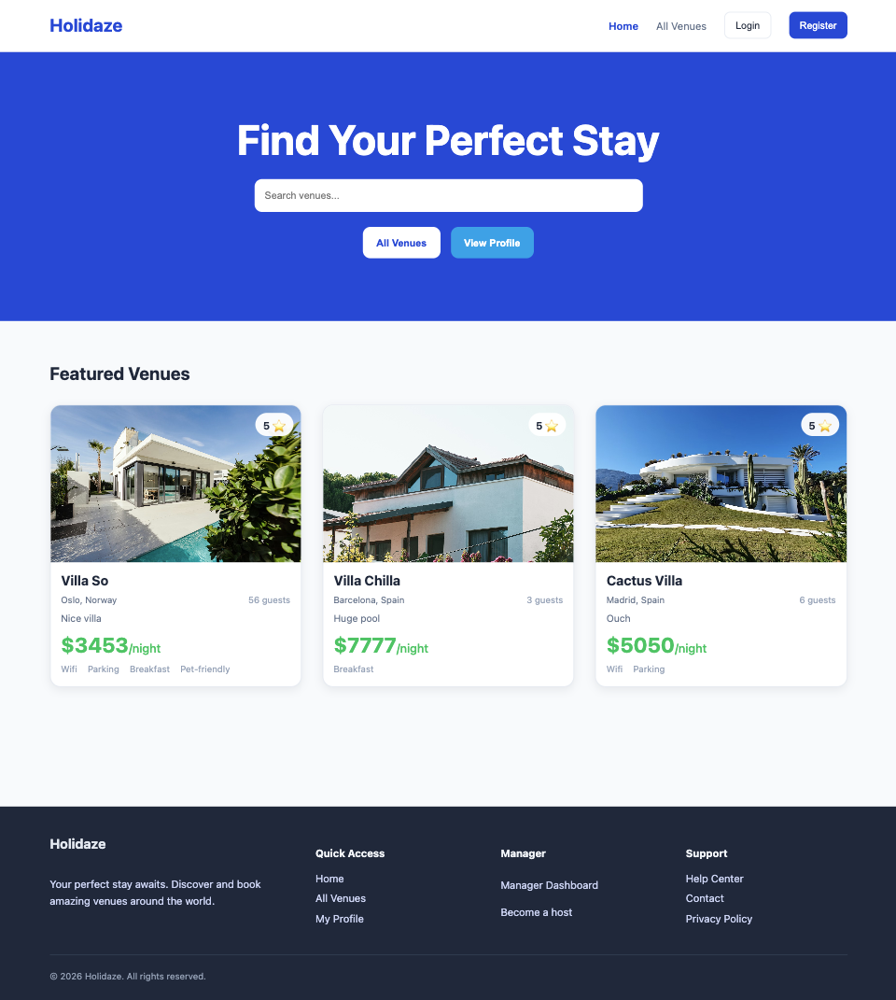

# Holidaze



## Overview

Holidaze is a booking application where users can browse venues, view venue details, create bookings, and manage their profile. The project also includes a manager dashboard where venue managers can create, update and delete venues, as well as view bookings for venues they manage.

This project was built as part of the Noroff Front-End Development Project Exam 2. The [brief](https://content.noroff.dev/project-exam-2/brief.html) required a customer-facing side for booking venues and an admin-facing side for venue managers. The application uses the [Noroff Holidaze API](https://docs.noroff.dev/docs/v2/holidaze/bookings).

## Design and Planning

- [Gantt Chart](https://github.com/users/SanderNilsen/projects/5/views/4?sortedBy%5Bdirection%5D=asc&sortedBy%5BcolumnId%5D=255978628)
- [Design Prototype](https://www.figma.com/design/cplx77RmZD3eRYPOvaWFPV/Project-Exam-2---Holidaze?node-id=0-1&t=dWNel3OefZMtbjCj-1)
- [Style Guide](https://www.figma.com/design/cplx77RmZD3eRYPOvaWFPV/Project-Exam-2---Holidaze?node-id=1-3&t=0fi7FotdZnMf9hAK-1)
- [Kanban Board](https://github.com/users/SanderNilsen/projects/5/views/1)
- [Repository](https://github.com/SanderNilsen/project-exam-2-holidaze)
- [Hosted Demo](https://holidaze-react.netlify.app/)

## Features

### Authentication

- Register with a `@stud.noroff.no` email
- Register as either a customer or venue manager
- Login with JWT authentication
- Logout functionality
- Role-based navigation and protected routes
- API key creation after login/register for authenticated requests

### Venues

- View a list of venues
- Search for venues
- Sort venues
- Load more venues with pagination
- View a single venue by id
- Display venue details
- Show map when location data is available

### Booking System

- Customers can create bookings
- Booking form validates:
  - selected date range
  - guest count
  - max guest limit
  - overlapping bookings
- Visual calendar for selecting available dates
- Customers can view upcoming and past bookings
- Customers can cancel upcoming bookings

### Profile

- View customer booking history
- View upcoming and past bookings
- Dynamic profile stats
- Update avatar using a public image URL

### Manager Dashboard

- View venues created by the logged-in manager
- Create new venues
- Edit existing venues
- Delete venues
- Add venue facilities
- View upcoming bookings for managed venues
- Update avatar using the shared avatar modal

### UI / UX

- Responsive layout
- Reusable component structure
- Styled Components for styling
- Shared dashboard layout for Profile and Manager pages
- User feedback through loading, error and success messages

## Tech Stack

- React
- React Router
- Styled Components
- React Day Picker
- Noroff Holidaze API
- LocalStorage for auth state
- Figma for design
- GitHub Projects for planning

## Project Structure

```text
src/
  api/
    auth.js
    bookings.js
    constants.js
    profile.js
    venues.js

  components/
    dashboard/
      AvatarModal.jsx
      BookingCard.jsx
      DashboardShell.jsx
      HeroPanel.jsx
      ManagerVenueCard.jsx
      ManagerVenueForm.jsx
      ProfileVenueCard.jsx
      SectionBlock.jsx
      SidebarCard.jsx
      SidebarElements.jsx

    layout/
      Footer.jsx
      Header.jsx
      Layout.jsx

    routes/
      CustomerRoute.jsx
      ManagerRoute.jsx

    ui/
      AuthCard.jsx
      FieldError.jsx
      FormMessage.jsx
      InputField.jsx
      Modal.jsx
      PrimaryButton.jsx
      SecondaryButton.jsx

    venues/
      BookingCalendar.jsx
      VenueCard.jsx
      VenueImageCarousel.jsx
      VenueMap.jsx

  pages/
    Home.jsx
    Login.jsx
    Manager.jsx
    Profile.jsx
    Register.jsx
    VenueDetails.jsx
    Venues.jsx

  styles/
    GlobalStyle.js

  utils/
    venueUtils.js
```

## API

This project uses the [Noroff Holidaze API](https://docs.noroff.dev/docs/v2/holidaze/bookings).

Main API resources used:

```text
POST /auth/register
POST /auth/login
POST /auth/create-api-key

GET /holidaze/venues
GET /holidaze/venues/:id
POST /holidaze/venues
PUT /holidaze/venues/:id
DELETE /holidaze/venues/:id

POST /holidaze/bookings
DELETE /holidaze/bookings/:id

GET /holidaze/profiles/:name/bookings
GET /holidaze/profiles/:name/venues
PUT /holidaze/profiles/:name
```

Authenticated requests require:

```text
Authorization: Bearer <accessToken>
X-Noroff-API-Key: <apiKey>
```

## Getting Started

### 1. Clone the repository

```bash
git clone https://github.com/SanderNilsen/project-exam-2-holidaze.git
```

### 2. Navigate into the project

```bash
cd project-exam-2-holidaze
```

### 3. Install dependencies

```bash
npm install
```

### 4. Run the development server

```bash
npm start
```

The application will run locally at:

```text
http://localhost:3000
```

## Environment / API Key

No manual `.env` setup is required for this project.

Authenticated requests use a JWT access token and a Noroff API key. Both are created through the Noroff API after login or registration and are stored in `localStorage` for the current session.

This allows the application to make authenticated requests such as creating bookings, updating profiles, and managing venues.